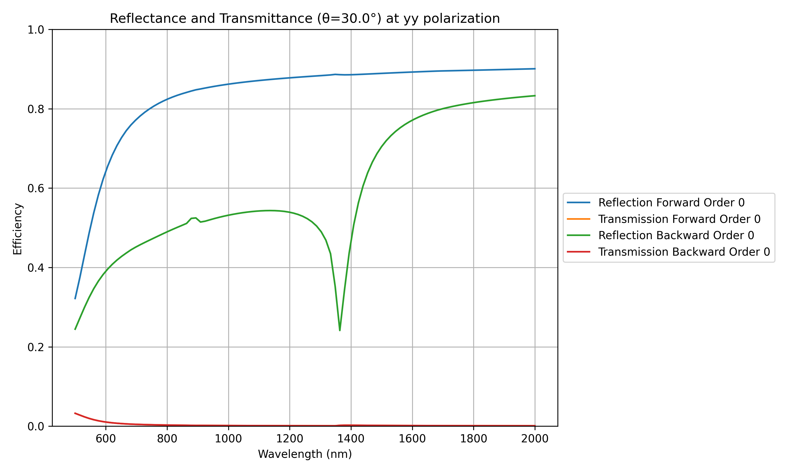
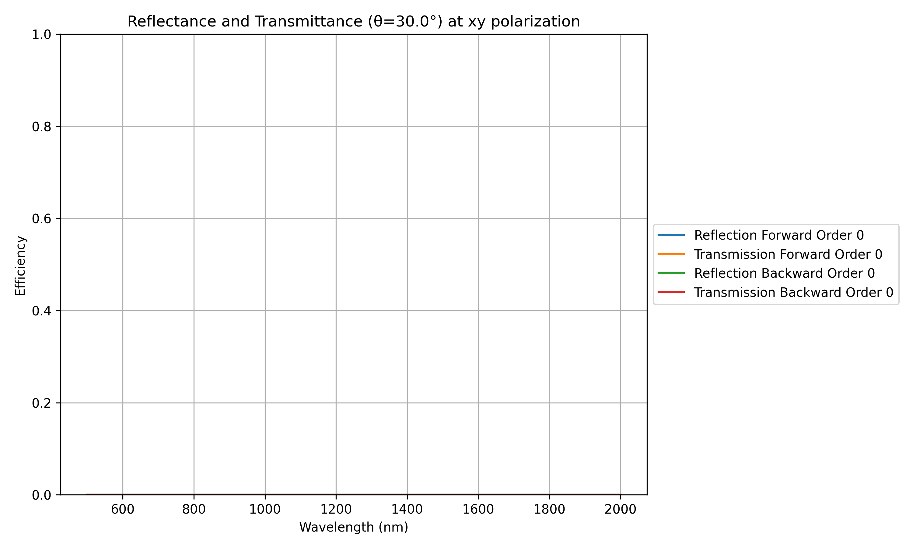
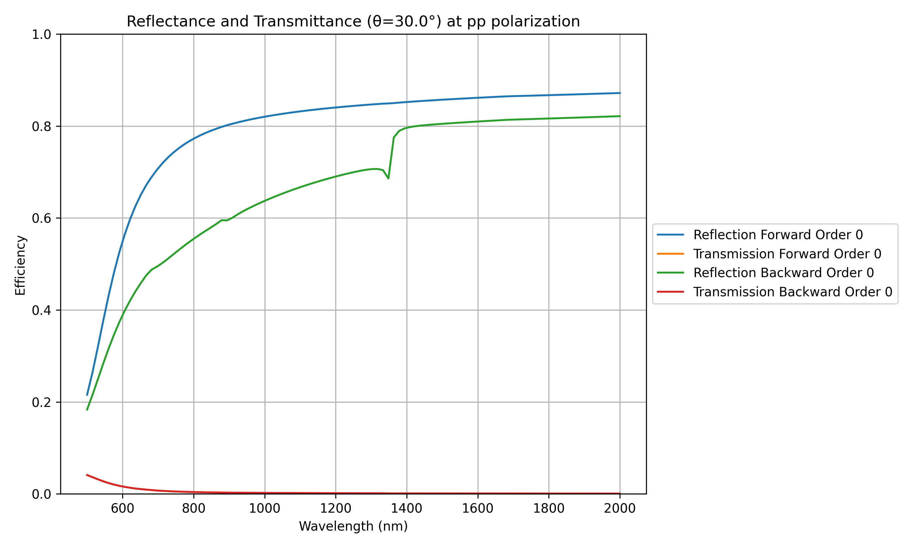
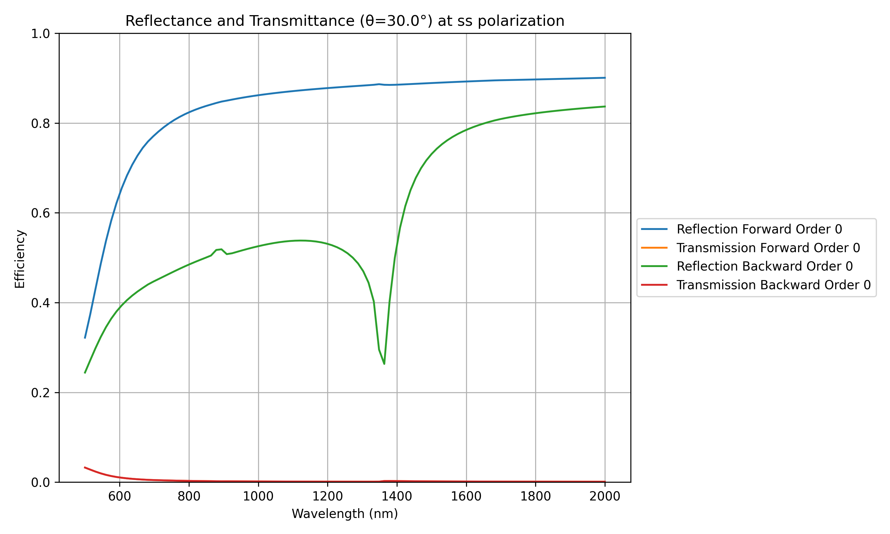
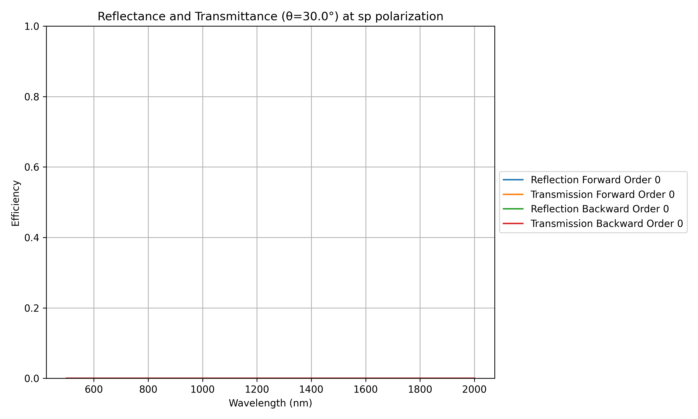

# SinTiN Torcwa

Simulation of the optical response of diffractive structures using TORCWA.

Here the structure is a sine grating of TiN on a SiO2 substrate.

## Table of numical parameters :

| Parameter               | Value     | Unit          | Description                                     |
|-------------------------|-----------|---------------|-------------------------------------------------|
| Wavelength range        | 500-2000  | nm            | Wavelength sweep range                          |
| Incident angle          | 30        | °             | Angle of incidence                              |
| Grating period          | 1000      | nm            | Period of the sine grating                      |
| Grating height          | 110       | nm            | Height of the sine grating (amplitude is 55 nm) |

## Eval orders :

Here only need to set y order as this is a 1D grating

## First order response

| xx polarization at 30° incidence            | yy polarization at 30° incidence            |
|---------------------------------------------|---------------------------------------------|
|   |   |

| xy polarization at 30° incidence            | yx polarization at 30° incidence            |
|---------------------------------------------|---------------------------------------------|
|   |   |

* * *

| pp polarization at 30° incidence            | ss polarization at 30° incidence            |
|---------------------------------------------|---------------------------------------------|
|   |   |

| ps polarization at 30° incidence            | sp polarization at 30° incidence            |
|---------------------------------------------|---------------------------------------------|
|   |   |
